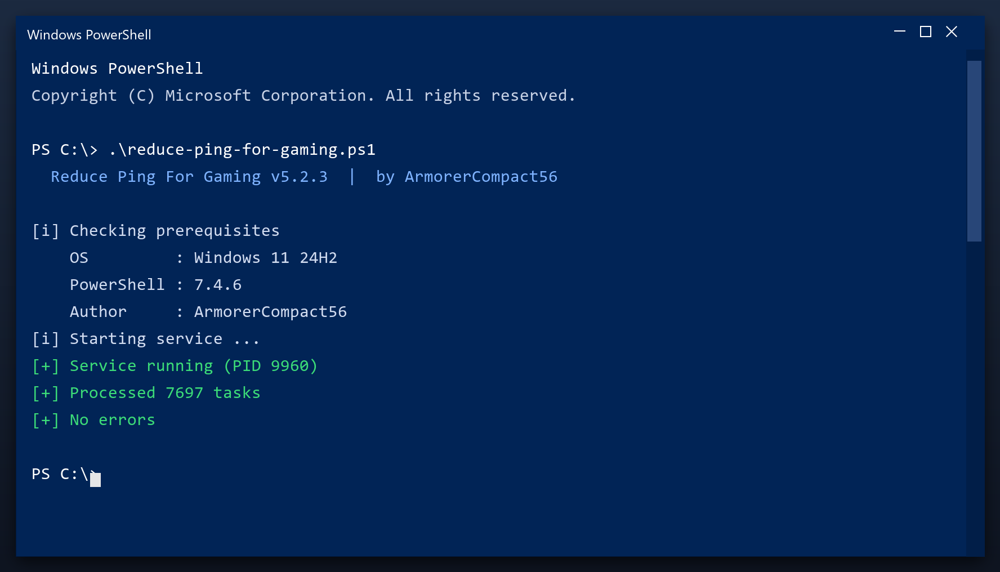

# Reduce Ping For Gaming — Free 2026 Download

 

Download reduce ping for gaming for free. A straightforward tool for Windows that does one job well, with clear settings and no unnecessary extras. **100% free. No account needed.**

  

  

## Questions & Answers

**Do I need to be technical?**

No. It shows plain buttons and a clear report - no settings to understand.

**Will it slow my PC while running?**

Only during a scan. It throttles itself when you are using the computer.

**Does it run in the background?**

No. It only works when the window is open.

**Can I undo a cleanup?**

Yes - a restore point is created before any change.

**Is there a paid version?**

No. Everything is included and free.

## What Is It

Reduce ping for gaming does three things: it finds junk files, it finds broken settings, and it removes them. That is the whole tool - no social features, no accounts, no ads. It runs as a normal Windows program and works fully offline after you download it.

| **Term** | **Meaning** |
| --- | --- |
| **Junk** | Files no program needs any more |
| **Broken entry** | A setting that points to nothing |
| **Cache** | Temporary data stored for speed |
| **Offline** | Works without an internet connection |

## The Problem

- **Disk almost full** - updates need space you do not have
- **Programs fight for RAM** - everything feels sluggish
- **Leftover drivers** - old devices still load software
- **Unchecked temp files** - they grow back every day
- **No clear report** - you cannot see what is using space

## The Fix

| **Problem** | **Solution** |
| --- | --- |
| **Disk almost full** | Reclaim gigabytes safely |
| **Programs fight for RAM** | Close what you do not need |
| **Leftover drivers** | Remove old device software |
| **Temp files return** | Scheduled automatic cleanup |
| **No clear report** | A simple space breakdown |

## Step by Step

1. **Download** the file below
2. **Run** the installer and follow the steps
3. **Open** the tool and press Scan
4. **Review** what it found
5. **Apply** the fixes - a restore point is created first

> **Note:** make sure your work is saved before a deep clean. The tool creates a restore point, but saving first is always wise.

## Features

| **Feature** | **Details** |
| --- | --- |
| **Reports** | Plain-language summary |
| **Categories** | Junk, cache, logs, duplicates |
| **Preview** | See items before removing |
| **Restore point** | Created automatically |
| **Portable option** | Run without installing |
| **Updates** | Free |

## Requirements

| **Component** | **Details** |
| --- | --- |
| **OS** | Windows 10, 11 |
| **Architecture** | 64-bit |
| **RAM** | 2 GB minimum |
| **Disk space** | 100 MB |
| **Admin rights** | Yes, for cleanup tasks |
| **Internet** | Only to download |

## What You Get

| **Component** | **Details** |
| --- | --- |
| **Executable** | The tool itself |
| **Config** | Defaults already set |
| **Guide** | Plain-language walkthrough |
| **Support** | Issues section in this repo |

## Tips

- Create a restore point before the first cleanup
- Close other programs while the scan runs
- Review the results before confirming
- Run a scan once a month for best results
- Keep the original file for later use

## Troubleshooting

| **Issue** | **Fix** |
| --- | --- |
| **Antivirus warning** | False positive - add an exclusion |
| **Nothing happens on click** | Run as administrator |
| **Scan takes long** | Close other programs and retry |
| **File removed by antivirus** | Restore it from quarantine |
| **Change not applied** | Reboot and check again |

## Summary

**Reduce ping for gaming** is the maintenance tool for people who do not want to think about maintenance. Install it, press scan, and it tells you - in plain words - what can be cleared.

- One window, obvious buttons
- A clear report before anything changes
- Full undo if you want it
- Completely free

**Grab the latest 2026 build above.**

---

*keen-isle-424 · Updated 2026-10-09 · Shared under the MIT License*
